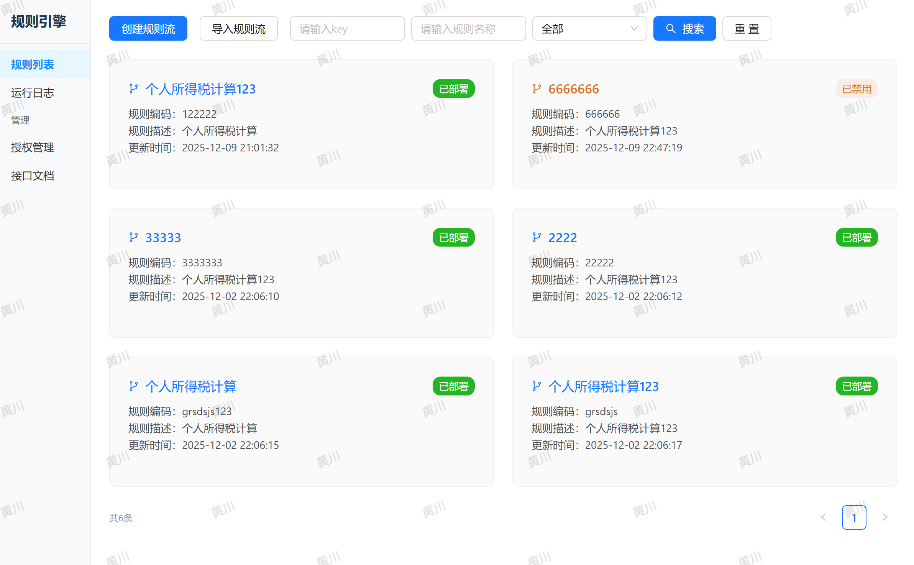
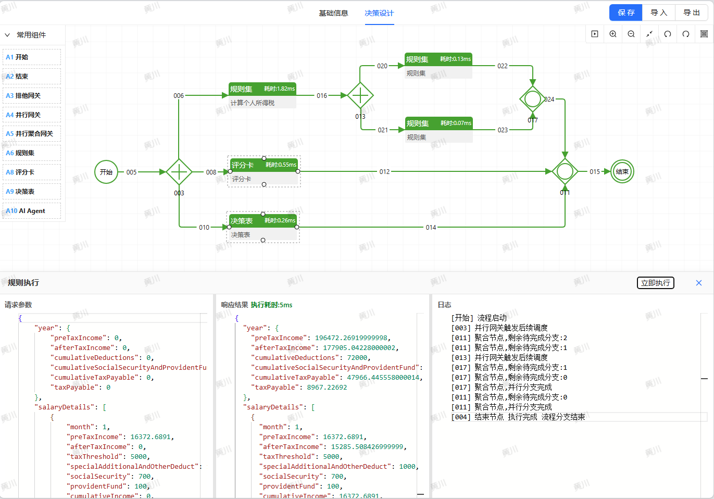
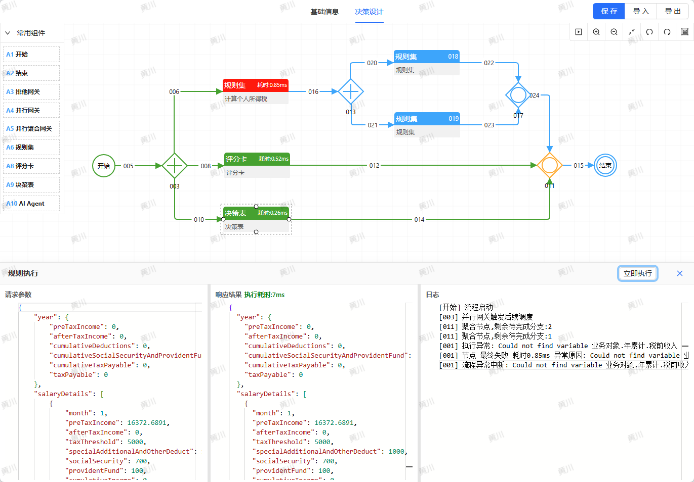
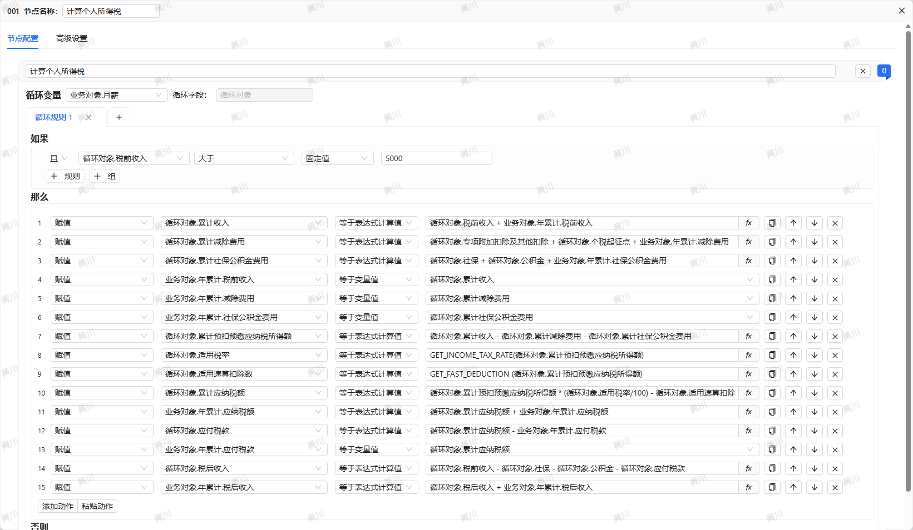
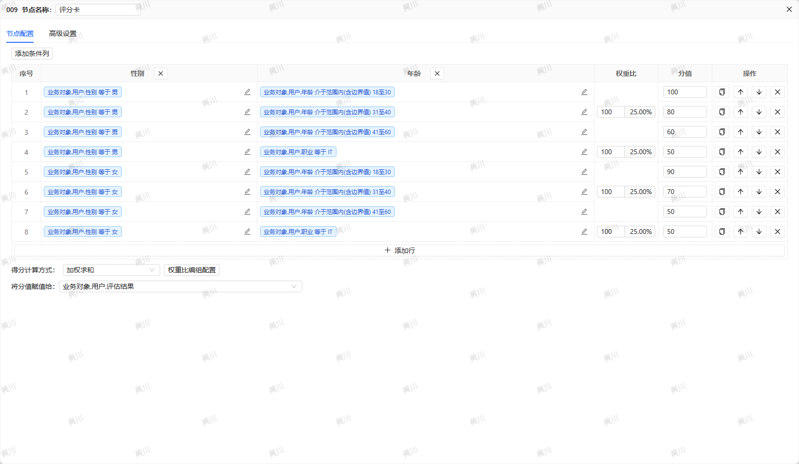
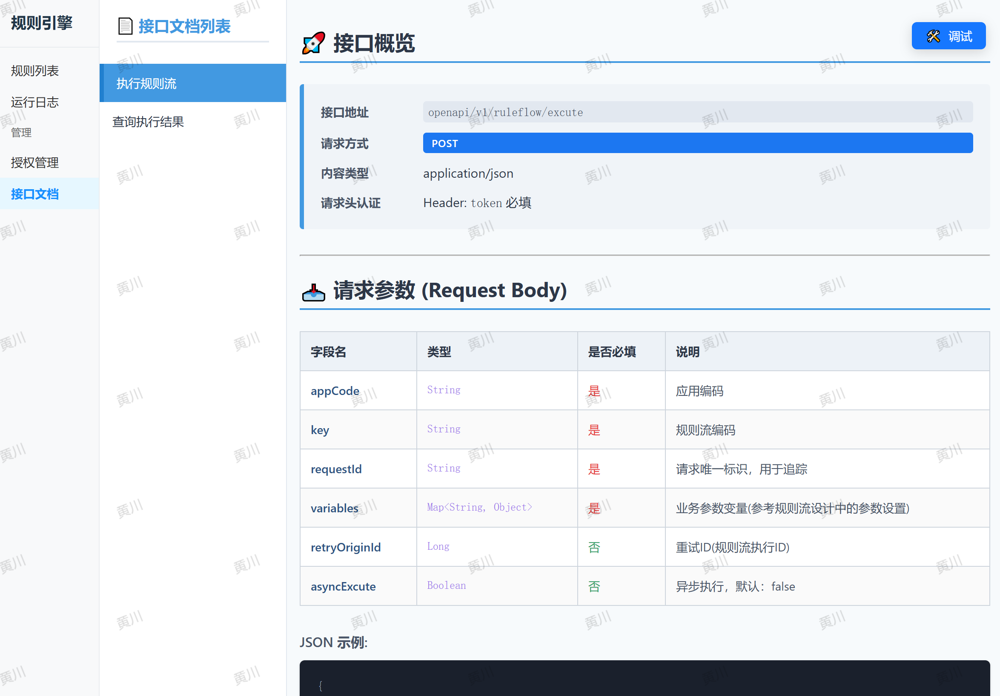
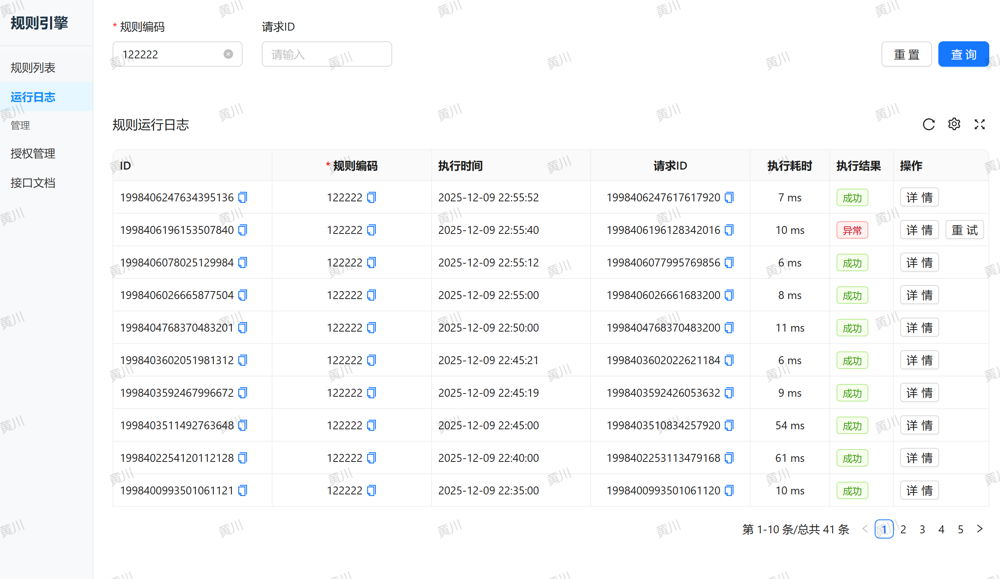
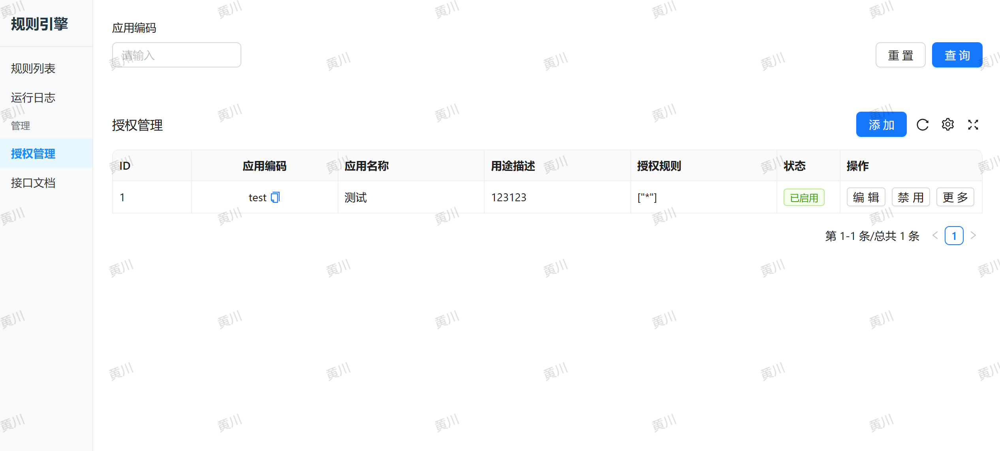
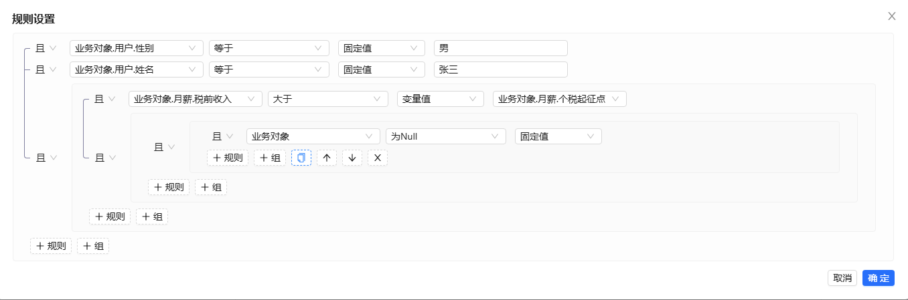
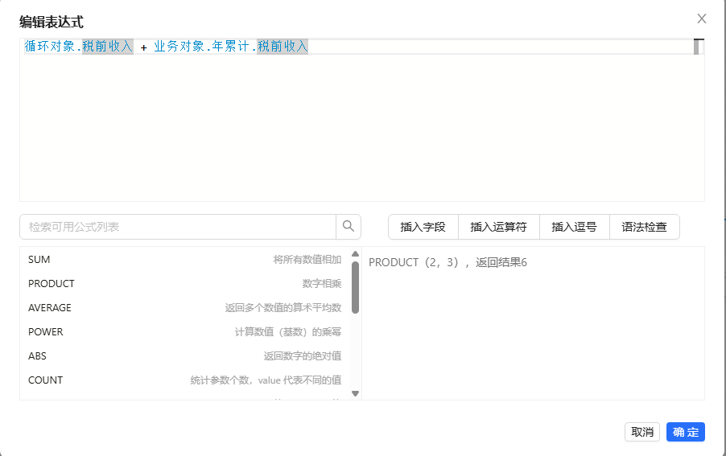

❤️ **支持作者，获取专业级前端设计器**

**规则引擎的核心调度器（基于 Java/Akka/Aviator）已采用 Apache License 2.0 协议开源，您可以免费使用、修改和集成到您的商业产品中。**

我们致力于构建高性能、高弹性的规则引擎后端，但这需要持续投入大量的精力进行维护、优化和新功能开发。

为了让项目能够健康发展，我们采取“后端开源，前端收费”的模式，可永久获取最新前端源码。

前端项目技术栈请查看package.json文件。

🚀 **支持与获取：**

如果您需要一个**专业、完整、可直接投入生产环境使用**的图形化前端设计器来编排和管理规则流程：

**请向作者付费 ¥399 元**。

付款时备注您的邮箱，付款成功后，您将立即获得**前端项目（rule-engine-web）的完整源码**，该源码可以直接与后端引擎对接，帮助您快速搭建业务规则平台。

您的支持是对开源技术的最大肯定，也是驱动我们持续迭代的动力！

联系作者获取前端源码：

作者邮箱：huchuc@vip.qq.com

感谢您的理解与支持！

## 截图展示

以下是规则引擎的主要功能截图：

### 规则引擎界面1

### 规则引擎界面2

### 规则引擎界面3

### 规则引擎界面4

### 规则引擎界面5

### 规则引擎界面6

### 规则引擎界面7

### 规则引擎界面8

### 条件构造界面

### 表达式编辑界面

